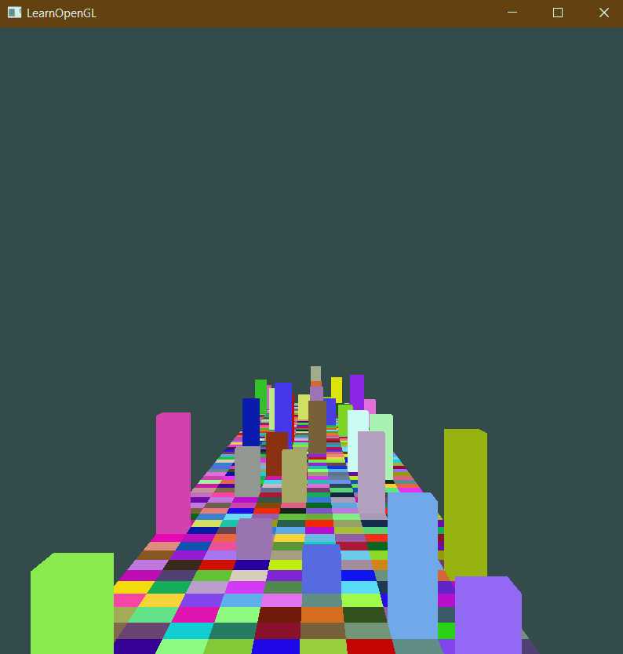

Simple 3D game made to try out and practice openGL.
Uses GLAD, GLFW, and GLM external libraries.

stb_image.h can be found [here](https://github.com/nothings/stb).

Written based on the introduction section of the tutorial [here](https://learnopengl.com/Introduction).

Controls:\
Can move with WASD and Space keys.\
Enter key toggles debug mode - doesn't do much except use a unrestricted camera.\
T key toggles textures.

Can run the exe on 64-bit windows.
